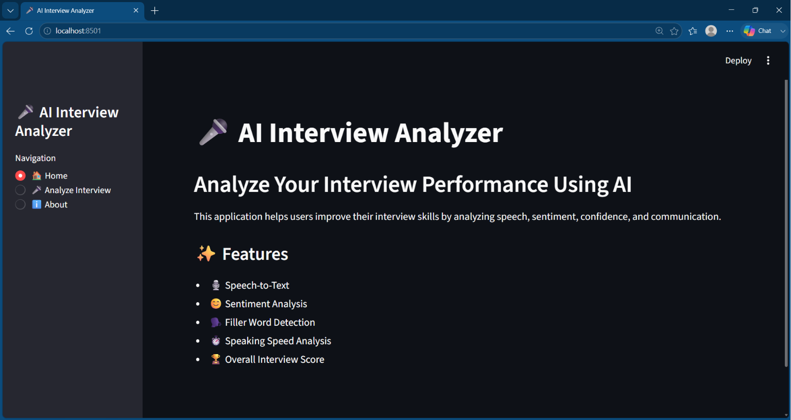
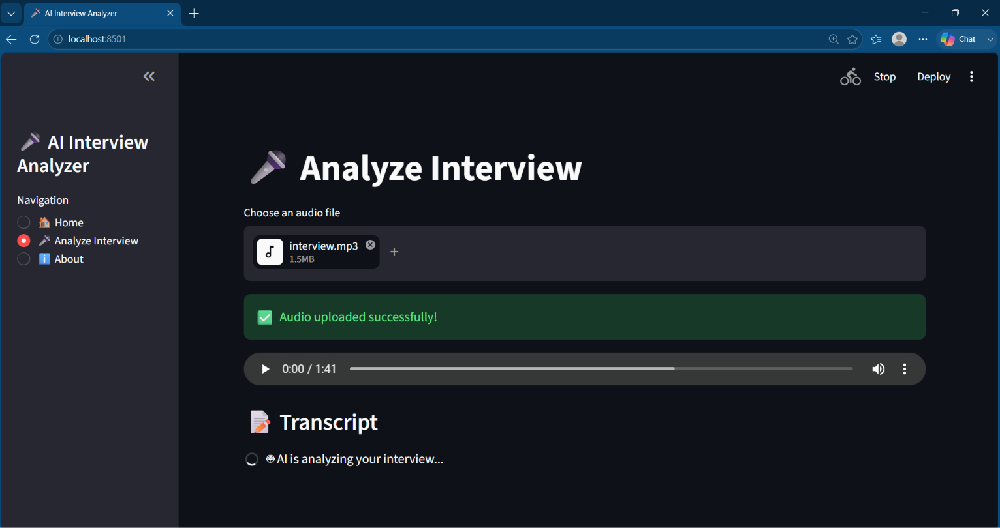
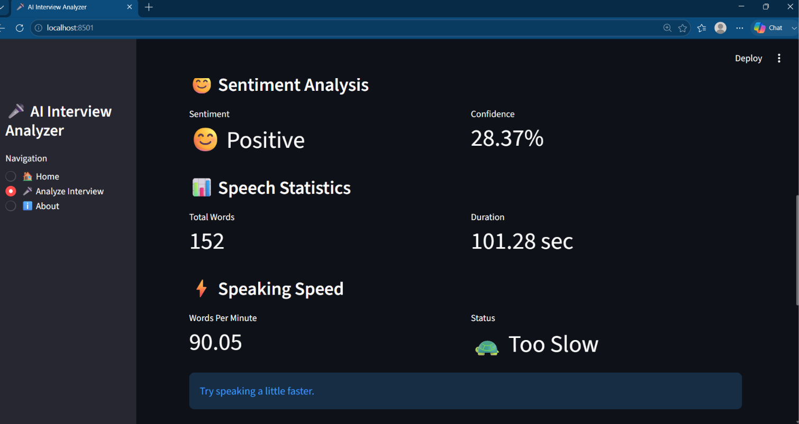

# 🎤 AI Interview Analyzer

An AI-powered web application that analyzes interview recordings and provides intelligent feedback on communication skills using Speech Recognition and Natural Language Processing (NLP).

Built with **Python**, **Streamlit**, **OpenAI Whisper**, and **TextBlob**.

---

## 🚀 Features

- 🎙️ Upload interview audio files
- 📝 Automatic Speech-to-Text transcription
- 😊 Sentiment Analysis
- 🗣️ Filler Word Detection
- ⏱️ Speaking Speed Analysis (Words Per Minute)
- 📊 Interview Statistics Dashboard
- 🏆 Overall Interview Score
- 📈 Progress Bar Visualization
- ⚡ Fast and Interactive Streamlit Interface

---

## 🛠️ Technologies Used

- Python
- Streamlit
- OpenAI Whisper
- TextBlob
- PyDub
- Torch (PyTorch)
- NLTK
- FFmpeg
- Pandas

---

## 📁 Project Structure

```
AI-Interview-Analyzer/
│
├── app.py
├── requirements.txt
├── README.md
├── .gitignore
├── uploads/
├── assets/
│
└── utils/
    ├── __init__.py
    ├── speech.py
    ├── analysis.py
    └── scoring.py
```

---

## ⚙️ Installation

Clone the repository:

```bash
git clone https://github.com/gursheen1106kaur/AI-Interview-Analyzer.git
```

Move into the project folder:

```bash
cd AI-Interview-Analyzer
```

Create a virtual environment:

```bash
python -m venv .venv
```

Activate the environment:

### Windows

```bash
.venv\Scripts\activate
```

Install dependencies:

```bash
pip install -r requirements.txt
```

---

## ▶️ Run the Project

```bash
streamlit run app.py
```

---

## 📸 Application Preview

### Home Page



### Interview Analysis



### Results Dashboard



---

## 🎯 Future Improvements

- 📄 PDF Report Generation
- 📊 Advanced Visualizations
- 🌐 Cloud Deployment
- 🤖 AI-based Interview Suggestions
- 🎥 Video Interview Analysis
- 📱 Mobile-Friendly Interface

---

## 👨‍💻 Author

**Gursheen Kaur Dhillon**

B.Tech (CSE - AI)

Passionate about Artificial Intelligence, Machine Learning, and Python Development.

---

## ⭐ If you found this project useful

Please consider giving this repository a ⭐ on GitHub.